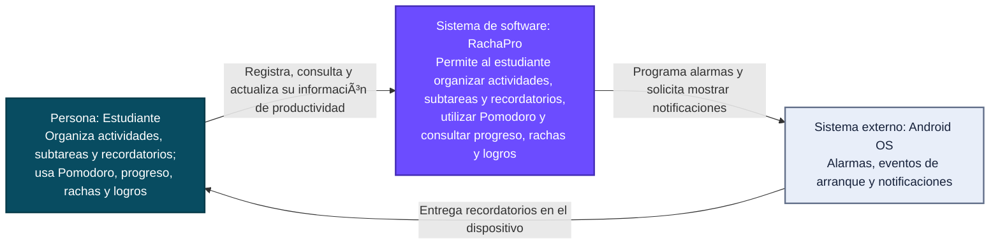

# C4 Nivel 1 — Contexto de RachaPro

## 1. Identificación de la evidencia

- **Sistema:** RachaPro — Gestor de Productividad Académica.
- **Vista:** C4 Nivel 1 — Contexto del sistema.
- **Estado representado:** arquitectura actual (*as-is*) observada en el repositorio.
- **Fecha de revisión:** 04 de septiembre de 2026.
- **Repositorio:** <https://github.com/alejandro4198/RachaProo>
- **Línea base auditada:** commit `126555982b011d31cb800c776ac1866d7296903e` de `master`.

La vista se construyó contrastando el modelo con el código, la configuración de Android, el backend y la infraestructura versionada. La existencia de una implementación en el repositorio no se presenta como evidencia de un despliegue productivo permanente.

## 2. Propósito de la vista

Esta vista responde la pregunta:

> ¿Quién utiliza RachaPro, qué responsabilidad general tiene el sistema y con qué sistema externo se relaciona en su operación actual?

Su propósito es delimitar RachaPro como sistema de software antes de mostrar sus aplicaciones, almacenes y componentes internos.

## 3. Audiencia

La vista resulta útil para:

- estudiantes, docentes y evaluadores que necesitan comprender el alcance general;
- integrantes del equipo que deben defender los límites del sistema;
- responsables de arquitectura y desarrollo que necesitan distinguir el sistema actual de una solución futura.

## 4. Diagrama de contexto

## 5. Elementos representados

| ID | Tipo C4 | Elemento | Responsabilidad | Evidencia principal |
|---|---|---|---|---|
| P-01 | Persona | Estudiante | Utilizar las funciones de productividad académica de RachaPro. | Pantallas Compose en `app/src/main/java/com/example/rachapro/` y navegación en `navigation/RachaProNavHost.kt`. |
| S-01 | Sistema de software | RachaPro | Gestionar usuarios, actividades, categorías, subtareas, recordatorios, Pomodoro, progreso, rachas, preferencias y logros. | Módulos `app/`, `backend/` e `infra/postgres/`. |
| SE-01 | Sistema externo | Android OS | Ejecutar alarmas, comunicar el reinicio del dispositivo y mostrar notificaciones locales. | Permisos y *receivers* en `app/src/main/AndroidManifest.xml`; `notifications/ReminderScheduler.kt`, `ReminderReceiver.kt`, `BootReceiver.kt` y `NotificationChannels.kt`. |

## 6. Relaciones verificadas

| Origen | Destino | Relación | Evidencia verificable |
|---|---|---|---|
| Estudiante | RachaPro | Interactúa con el sistema mediante la aplicación móvil. | `MainActivity.kt`, `navigation/RachaProNavHost.kt` y pantallas de `auth/`, `activities/`, `pomodoro/`, `progress/`, `profile/`, `home/` y `calendar/`. |
| RachaPro | Android OS | Programa alarmas exactas o inexactas y registra receptores para recordatorios y reinicio. | `ReminderScheduler.schedule`, `ReminderReceiver.onReceive`, `BootReceiver.onReceive` y declaraciones del manifiesto. |
| Android OS | Estudiante | Presenta las notificaciones locales solicitadas por RachaPro. | `NotificationManagerCompat.notify` en `ReminderReceiver.kt`. |

## 7. Límites y exclusiones del contexto actual

- El backend y PostgreSQL forman parte interna de RachaPro y se descomponen en el Nivel 2; por eso no aparecen como sistemas externos en esta vista.
- No se identificaron integraciones actuales con Google Calendar, correo, redes sociales, pasarelas de pago, Firebase u otros servicios de terceros.
- No se identificó un administrador como actor funcional del sistema actual.
- El repositorio contiene una dirección HTTP de red local para el backend. Esto demuestra la relación implementada, pero no demuestra un despliegue público o disponibilidad continua.
- Los artefactos históricos o las ideas de sincronización futura no se modelan como parte de la arquitectura *as-is* si no tienen una implementación actual verificable.

## 8. Cómo defender esta vista

Desde esta vista se puede navegar al repositorio de la siguiente forma:

1. La interacción del estudiante se ubica desde `MainActivity` hasta `RachaProNavHost` y las pantallas Compose.
2. El límite de RachaPro se descompone en la aplicación Android, sus almacenes locales, la API y PostgreSQL en `06-c4-contenedores.md`.
3. La relación con Android se demuestra con los permisos, los receptores y las llamadas a `AlarmManager` y `NotificationManagerCompat`.
