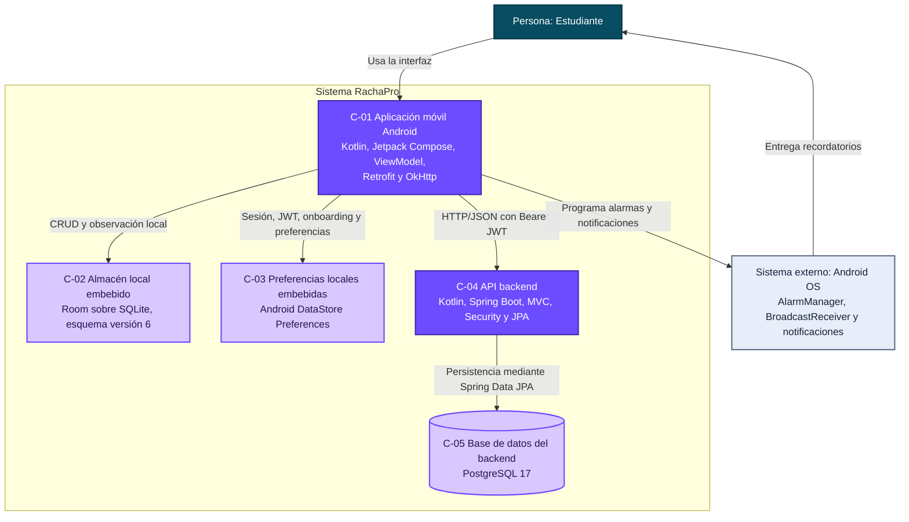

# C4 Nivel 2 — Contenedores de RachaPro

## 1. Identificación de la evidencia

- **Sistema:** RachaPro — Gestor de Productividad Académica.
- **Vista:** C4 Nivel 2 — Contenedores.
- **Estado representado:** arquitectura actual (*as-is*) observada en el repositorio.
- **Fecha de revisión:** 04 de septiembre de 2026.
- **Repositorio:** <https://github.com/alejandro4198/RachaProo>
- **Línea base auditada:** commit `126555982b011d31cb800c776ac1866d7296903e` de `master`.

## 2. Propósito de la vista

Esta vista responde la pregunta:

> ¿Cuáles son las unidades ejecutables y los almacenes de datos actuales de RachaPro, qué tecnologías utilizan y cómo se comunican?

La vista separa la aplicación Android, sus dos mecanismos de almacenamiento local, la API del backend y PostgreSQL. También muestra a Android OS fuera del límite del sistema.

## 3. Audiencia

La vista está dirigida a:

- desarrolladores que deben ejecutar, mantener o modificar RachaPro;
- evaluadores que necesitan comprobar que cada contenedor tiene un ancla real;
- responsables de arquitectura, despliegue y pruebas;
- nuevos integrantes que necesitan comprender la distribución física y tecnológica.

## 4. Diagrama de contenedores

## 5. Catálogo de contenedores

| ID | Contenedor                     | Responsabilidad actual | Tecnología | Ancla verificable |
|---|--------------------------------|---|---|---|
| C-01 | Aplicación móvil Android       | Presentar la interfaz, coordinar casos de uso, utilizar persistencia local, consumir la API y solicitar recordatorios al sistema operativo. | Kotlin, Android SDK, Jetpack Compose, ViewModel, Navigation Compose, Retrofit y OkHttp. | `app/build.gradle.kts`, `app/src/main/AndroidManifest.xml`, `MainActivity.kt` y `RachaProApplication.kt`. |
| C-02 | Almacén local embebido         | Mantener estructuras y operaciones locales para usuarios, categorías, actividades, subtareas, recordatorios, sesiones Pomodoro y logros. | Room sobre SQLite, esquema versión 6 y migraciones 1→6. | `data/local/RachaProDatabase.kt`, `data/local/entity/` y `data/local/dao/`. |
| C-03 | Preferencias locales embebidas | Persistir sesión, token JWT, onboarding y preferencias personalizadas de Pomodoro y notificaciones. | Android DataStore Preferences. | `data/local/SessionManager.kt` y `data/local/UserPreferencesManager.kt`. |
| C-04 | API backend                    | Exponer operaciones REST autenticadas para usuarios, categorías, actividades, subtareas, recordatorios, Pomodoro y logros; aplicar reglas y acceso a datos. | Kotlin, Spring Boot 4.1.1, Spring MVC, Spring Security, OAuth2 Resource Server, JWT HS256 y Spring Data JPA. | `backend/build.gradle.kts`, `backend/src/main/kotlin/com/example/rachapro/backend/` y `backend/src/main/resources/application.properties`. |
| C-05 | Base de datos del backend      | Conservar la información central administrada por la API y aplicar claves, restricciones e índices. | PostgreSQL 17. | `infra/postgres/docker-compose.yml` e `infra/postgres/init/001-schema.sql`. |

## 6. Relaciones entre contenedores

| ID | Origen | Destino                             | Relación comprobada | Evidencia |
|---|---|-------------------------------------|---|---|
| RC-01 | Estudiante | C-01 Aplicación móvil Android       | Usa pantallas Compose para registro, autenticación y gestión de productividad. | `MainActivity.kt` y `navigation/RachaProNavHost.kt`. |
| RC-02 | C-01 Aplicación móvil Android | C-02 Base de datos local            | Los repositorios usan DAOs; algunos flujos remotos actualizan Room y otros mantienen los resultados solo en memoria. | `RachaProApplication.kt`, `data/repository/*.kt`, `data/local/dao/*.kt` y `data/local/entity/*.kt`. |
| RC-03 | C-01 Aplicación móvil Android | C-03 Preferencias locales embebidas | Lee y escribe el usuario activo, JWT, onboarding y preferencias por usuario. | `SessionManager.kt`, `UserPreferencesManager.kt`, `AuthViewModel.kt`, `AppStartViewModel.kt` y `ProfileViewModel.kt`. |
| RC-04 | C-01 Aplicación móvil Android | C-04 API backend                    | Retrofit declara los endpoints y OkHttp agrega `Authorization: Bearer`; los repositorios invocan `ApiService`. | `network/RetrofitClient.kt`, `ApiService.kt`, `AuthInterceptor.kt`, `data/repository/*.kt`. |
| RC-05 | C-04 API backend | C-05 Base de datos del backend      | Servicios usan repositorios `JpaRepository`; el datasource se configura mediante variables de entorno. | `backend/**/**Repository.kt`, `backend/**/**Service.kt` y `application.properties`. |
| RC-06 | C-01 Aplicación móvil Android | Android OS                          | Programa/cancela alarmas, recibe eventos y publica notificaciones. | `notifications/*.kt` y `AndroidManifest.xml`. |

## 7. Comportamiento de datos observado

La aplicación no es únicamente local ni únicamente remota. El flujo implementado combina ambos lados de manera parcial:

1. La interfaz delega acciones en los `ViewModel`.
2. Los `ViewModel` usan repositorios de la aplicación.
3. Los repositorios invocan `ApiService` para varias operaciones remotas.
4. Usuarios, Pomodoro, recordatorios y logros contienen operaciones que guardan en Room información obtenida o confirmada por la API.
5. En actividades, categorías y subtareas existen flujos que obtienen respuestas remotas y las convierten para uso en memoria sin demostrar una actualización general de las tablas Room equivalentes.
6. Varios cálculos de inicio, progreso y perfil observan DAOs locales mediante `Flow`.
7. DataStore conserva la identidad activa y el JWT usado por `AuthInterceptor`.

**INFERENCIA DE AUDITORÍA**: A partir del comportamiento observado, el patrón puede describirse como acceso híbrido remoto/local en transición. No se identificó un motor general de sincronización, una estrategia offline-first uniforme ni resolución general de conflictos.

## 8. Alcance de despliegue y ejecución

- `app/` es el módulo incluido por el proyecto Gradle raíz mediante `include(":app")`.
- `backend/` tiene sus propios `settings.gradle.kts`, `build.gradle.kts` y *wrapper*; por tanto, es un proyecto Gradle ejecutable separado, no un submódulo incluido en el Gradle raíz.
- PostgreSQL dispone de una definición reproducible en Docker Compose y un esquema SQL inicial.
- La app configura `http://192.168.1.20:8080/` como URL base y habilita tráfico HTTP en claro. Esto verifica una conexión prevista dentro de una red local; no acredita un despliegue en nube ni una dirección estable para otros entornos.
- `application.properties` exige `RACHAPRO_DB_URL`, `RACHAPRO_DB_USER`, `RACHAPRO_DB_PASSWORD` y la configuración JWT exige `RACHAPRO_JWT_SECRET`.

## 9. Elementos que no deben confundirse con contenedores

- Las pantallas, `ViewModel`, repositorios, DAOs, controladores y servicios son componentes internos, no contenedores independientes.
- Room y DataStore están embebidos en el dispositivo; se muestran como almacenes separados para hacer explícita la responsabilidad de persistencia, no como servidores.
- Android OS es externo al límite de RachaPro.
- No se encontró evidencia de una aplicación web, panel administrativo, microservicios, Firebase, un *message broker* o un servicio externo de notificaciones.

## 10. Riesgos y restricciones visibles en esta vista

- La disponibilidad de funciones remotas depende de que el backend sea alcanzable en la URL configurada.
- La URL fija de red local dificulta mover la app entre entornos sin modificar y recompilar código.
- `android:usesCleartextTraffic="true"` y el uso de HTTP sin TLS son restricciones relevantes para seguridad.
- La coexistencia de Room y PostgreSQL requiere mantener coherencia entre datos locales y remotos; el código actual no demuestra una estrategia general y uniforme de sincronización o resolución de conflictos.
