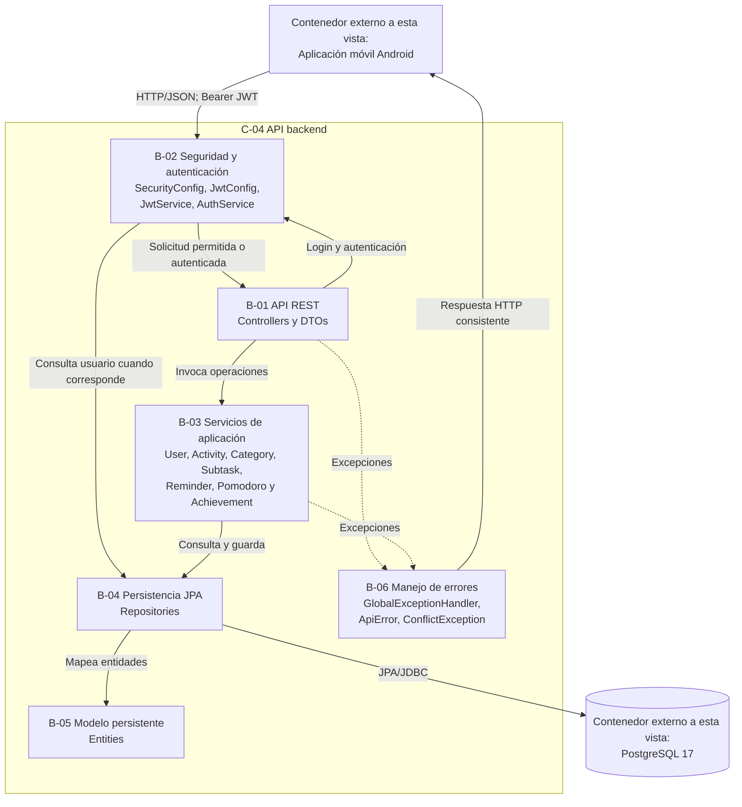
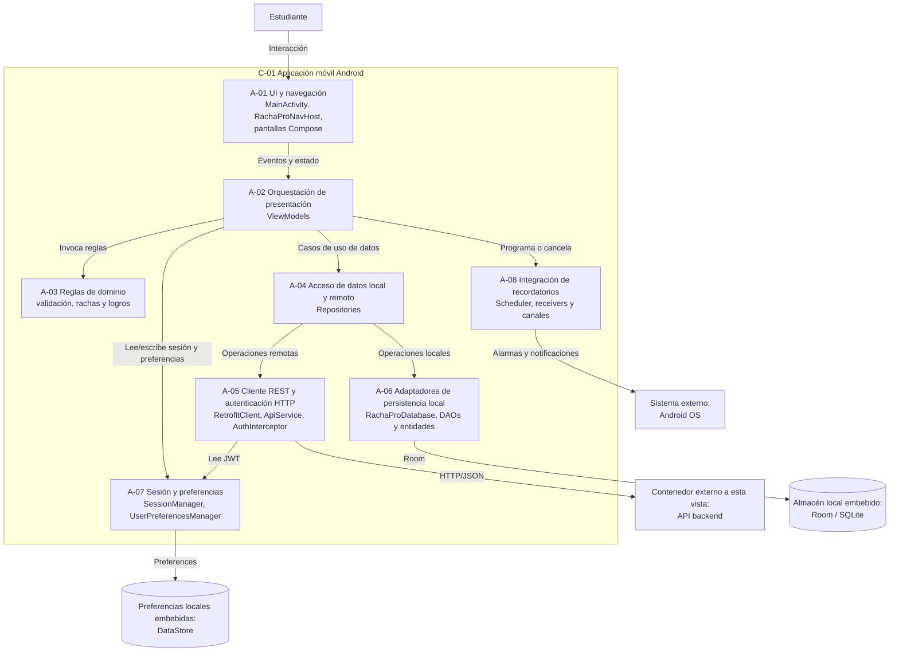

# C4 Nivel 3 — Componentes de RachaPro

## 1. Identificación de la evidencia

- **Sistema:** RachaPro — Gestor de Productividad Académica.
- **Vista:** C4 Nivel 3 — Componentes.
- **Estado representado:** arquitectura actual (*as-is*) observada en el repositorio.
- **Fecha de auditoría original:** 04 de septiembre de 2026.
- **Fecha de actualización:** 05 de septiembre de 2026.
- **Repositorio:** <https://github.com/alejandro4198/RachaProo>
- **Línea base auditada:** commit `126555982b011d31cb800c776ac1866d7296903e` de `master`.

La revisión posterior entre la línea base auditada y el estado actual no mostró cambios en `app/`, `backend/` ni `infra/`, por lo que las anclas arquitectónicas utilizadas en esta vista continúan siendo aplicables.

---

## 2. Propósito de la vista

Esta vista responde la pregunta:

> ¿Qué componentes arquitectónicamente relevantes conforman la API backend de RachaPro, cuáles son sus responsabilidades y dónde se comprueba cada relación en el código?

La vista principal de Nivel 3 descompone la **API backend**, seleccionada por el equipo como el contenedor más crítico de RachaPro.

No se busca inventariar todas las clases del backend, sino representar grupos cohesivos que permitan comprender su estructura, responsabilidades y dependencias verificables.

La descomposición de la aplicación Android se conserva únicamente como **vista complementaria**, ya que no corresponde al contenedor seleccionado como crítico para el entregable principal de Semana 6.

---

## 3. Audiencia

La vista está dirigida a:

- desarrolladores que modifican la API backend;
- evaluadores que necesitan pasar de cada componente C4 al código real;
- responsables de seguridad, persistencia, pruebas y mantenimiento;
- integrantes nuevos que necesitan comprender las dependencias y puntos de cambio del backend.

---

## 4. Selección del contenedor crítico

**DECISIÓN ACTUAL DEL EQUIPO — 05/09/2026**

Se seleccionó la **API backend** como el contenedor más crítico de RachaPro porque concentra responsabilidades esenciales para el funcionamiento del sistema.

Allí se gestionan la autenticación y autorización mediante JWT, el manejo centralizado de errores, la recepción y validación de datos enviados por la aplicación, la aplicación de reglas y procesos del sistema, y el acceso a la persistencia central en PostgreSQL.

Además, el backend organiza los servicios, repositorios, dependencias y módulos que permiten transformar las solicitudes de la aplicación en operaciones sobre los datos de los usuarios.

Por estas razones, una falla en este contenedor puede afectar varias funciones centrales de RachaPro.

---

## 5. C4 Nivel 3 — Componentes de la API backend

### Interpretación de la vista

La aplicación Android realiza solicitudes HTTP hacia la API.

La configuración de Spring Security protege los recursos definidos como autenticados antes de permitir que la solicitud continúe hacia los controladores correspondientes.

El proceso de login utiliza `AuthController`, `AuthService` y `JwtService` para verificar credenciales y emitir el token JWT.

Los controladores delegan las operaciones funcionales en servicios de aplicación.

Los servicios utilizan repositorios Spring Data JPA para consultar o modificar la información persistida en PostgreSQL.

El modelo persistente representa las entidades almacenadas, mientras que el manejo de errores se representa de forma separada porque cumple una responsabilidad transversal distinta.

---

## 6. Responsabilidades de los componentes backend

| ID | Componente | Responsabilidad | Símbolos principales |
|---|---|---|---|
| B-01 | API REST | Recibir solicitudes HTTP, trabajar con DTOs, obtener la identidad autenticada cuando corresponde y delegar las operaciones de la API. | `AuthController`, `UserController`, `CategoryController`, `ActivityController`, `SubtaskController`, `ReminderController`, `PomodoroSessionController`, `AchievementController` y paquetes `dto`. |
| B-02 | Seguridad y autenticación | Configurar protección de endpoints, verificar credenciales, emitir JWT y validar solicitudes autenticadas. | `SecurityConfig`, `JwtConfig`, `JwtService`, `AuthService`, `PasswordHasher`. |
| B-03 | Servicios de aplicación | Ejecutar operaciones y reglas correspondientes a usuarios, categorías, actividades, subtareas, recordatorios, Pomodoro y logros. | `UserService`, `CategoryService`, `ActivityService`, `SubtaskService`, `ReminderService`, `PomodoroSessionService`, `AchievementService`. |
| B-04 | Persistencia JPA | Proporcionar consultas y escritura sobre las entidades administradas por el backend mediante Spring Data JPA. | Interfaces `*Repository : JpaRepository<..., Long>`. |
| B-05 | Modelo persistente | Representar mediante entidades JPA la información almacenada por el backend. | Clases `*Entity` anotadas con `@Entity`. |
| B-06 | Manejo de errores | Centralizar la transformación de errores y excepciones conocidas en respuestas HTTP consistentes. | `GlobalExceptionHandler`, `ApiError`, `ConflictException`. |

---

## 7. Flujos arquitectónicos comprobados

### 7.1 Autenticación

1. La aplicación Android envía las credenciales mediante `POST /api/auth/login`.
2. La solicitud llega a `AuthController`.
3. `AuthController` delega la operación en `AuthService`.
4. `AuthService` consulta al usuario y verifica la contraseña.
5. `JwtService` genera el JWT correspondiente al usuario autenticado.
6. La API devuelve el token y la información del usuario.
7. La aplicación almacena el token mediante `SessionManager`.
8. `AuthInterceptor` añade posteriormente `Authorization: Bearer <token>` a las solicitudes protegidas.
9. Spring Security valida el JWT antes de permitir el acceso a los recursos protegidos.

Este flujo relaciona principalmente los componentes **B-01, B-02 y B-04**.

---

### 7.2 Creación de actividades

1. La aplicación realiza `POST /api/activities` con un JWT válido.
2. La capa de seguridad valida la autenticación de la solicitud.
3. `ActivityController` recibe la petición de creación.
4. `ActivityService` ejecuta las validaciones y reglas correspondientes.
5. El servicio comprueba la categoría asociada y la identidad del usuario.
6. El repositorio JPA persiste la entidad correspondiente.
7. PostgreSQL conserva la información.
8. La API devuelve la respuesta HTTP al cliente.

Este flujo muestra la secuencia:

`Aplicación Android → B-02 → B-01 → B-03 → B-04 → B-05 → PostgreSQL`

La operación `POST /api/activities` también fue utilizada en EXP-002 como operación de rendimiento, aunque la evidencia experimental se conserva separada de esta vista estructural.

---

### 7.3 Persistencia

Los servicios de aplicación no acceden directamente a PostgreSQL.

La relación observada sigue la secuencia:

`Servicio → Repository JPA → Entity → PostgreSQL`

Los repositorios extienden `JpaRepository` y actúan como mecanismo de acceso persistente utilizado por los servicios del backend.

PostgreSQL permanece como un contenedor independiente y no como un componente interno de la API.

---

### 7.4 Manejo de errores

El backend posee un mecanismo centralizado para producir respuestas de error consistentes.

`GlobalExceptionHandler` actúa sobre excepciones manejadas por la aplicación y utiliza estructuras como `ApiError` para construir la respuesta correspondiente.

Por esta razón el manejo de errores se representa como **B-06**, separado de las entidades persistentes de **B-05**.

---

## 8. Trazabilidad C4

La tabla utiliza la estructura solicitada:

**ID — Nivel C4 — Tipo — Responsabilidad — Ancla verificable — Evidencia — Estado**

| ID | Nivel C4 | Tipo | Responsabilidad | Ancla verificable | Evidencia | Estado |
|---|---|---|---|---|---|---|
| P-01 | Nivel 1 | Persona | Utilizar RachaPro para organizar y seguir su productividad académica. | `app/src/main/java/com/example/rachapro/` | Pantallas Compose y rutas definidas en `RachaProNavHost`. | Verificado |
| S-01 | Nivel 1 | Sistema de software | Gestionar actividades, subtareas, recordatorios, Pomodoro, progreso, rachas, perfil y logros. | `app/`, `backend/`, `infra/postgres/` | Los tres grupos de artefactos conforman la implementación actual de RachaPro. | Verificado |
| SE-01 | Nivel 1 | Sistema externo | Proporcionar alarmas, eventos de arranque y notificaciones locales. | `AndroidManifest.xml`; paquete `notifications/` | `AlarmManager`, `BootReceiver`, `ReminderReceiver`, `NotificationChannels`. | Verificado |
| C-01 | Nivel 2 | Contenedor | Proporcionar la interfaz móvil y coordinar operaciones locales y remotas. | `app/` | `MainActivity`, `RachaProApplication`, módulo Android compilable. | Verificado |
| C-02 | Nivel 2 | Almacén local embebido | Mantener datos locales utilizados por la aplicación Android. | `data/local/RachaProDatabase.kt`, `entity/`, `dao/` | `RoomDatabase`, siete entidades, siete DAOs y migraciones. | Verificado |
| C-03 | Nivel 2 | Preferencias locales embebidas | Persistir sesión, JWT, onboarding y preferencias por usuario. | `SessionManager.kt`, `UserPreferencesManager.kt` | DataStore, `SessionState.authToken`, preferencias Pomodoro y `notificationsEnabled`. | Verificado |
| C-04 | Nivel 2 | Contenedor | Exponer la API REST, aplicar reglas, gestionar seguridad y acceder a persistencia central. | `backend/` | Proyecto Spring Boot independiente con controladores, servicios, seguridad y repositorios. | Verificado |
| C-05 | Nivel 2 | Almacén de datos | Persistir la información central administrada por el backend. | `infra/postgres/docker-compose.yml`, `infra/postgres/init/001-schema.sql` | PostgreSQL 17, tablas, restricciones, claves e índices. | Verificado |
| B-01 | Nivel 3 / C-04 | Componente | Exponer recursos REST y convertir solicitudes HTTP en llamadas de aplicación. | `backend/src/main/kotlin/com/example/rachapro/backend/**/**Controller.kt` | Ocho controladores y DTOs para los recursos implementados. | Verificado |
| B-02 | Nivel 3 / C-04 | Componente | Gestionar autenticación, autorización y JWT. | `backend/.../security/`, `backend/.../auth/`, `PasswordHasher.kt` | `SecurityConfig`, `JwtConfig`, `JwtService`, `AuthService`. | Verificado |
| B-03 | Nivel 3 / C-04 | Componente | Ejecutar reglas y operaciones de aplicación. | `backend/src/main/kotlin/com/example/rachapro/backend/**/**Service.kt` | Servicios para usuarios, categorías, actividades, subtareas, recordatorios, Pomodoro y logros. | Verificado |
| B-04 | Nivel 3 / C-04 | Componente | Consultar y modificar datos persistentes mediante Spring Data JPA. | `backend/src/main/kotlin/com/example/rachapro/backend/**/**Repository.kt` | Interfaces que extienden `JpaRepository`. | Verificado |
| B-05 | Nivel 3 / C-04 | Componente | Representar el modelo persistente utilizado por JPA. | `backend/src/main/kotlin/com/example/rachapro/backend/**/**Entity.kt` | Clases anotadas con `@Entity` asociadas al esquema persistente. | Verificado |
| B-06 | Nivel 3 / C-04 | Componente transversal | Convertir excepciones manejadas en respuestas HTTP consistentes. | `backend/.../error/` | `GlobalExceptionHandler`, `ApiError`, `ConflictException`. | Verificado |

---

## 9. Registro de correcciones y eliminaciones después de validar contra el código

| ID | Elemento del entendimiento inicial | Resultado de la auditoría | Evidencia que motivó el cambio | Estado |
|---|---|---|---|---|
| AUD-01 | RachaPro se entendía principalmente como una aplicación Android local. | Se incorporaron la API backend y PostgreSQL como contenedores actuales implementados en el repositorio. | Directorios `backend/` e `infra/postgres/`; controladores Spring y configuración de datasource. | Corregido |
| AUD-02 | La tecnología concreta de `RachaProDatabase` estaba pendiente. | Se precisó que corresponde a Room sobre SQLite, versión 6, con siete entidades, siete DAOs y migraciones explícitas. | `RachaProDatabase : RoomDatabase`, anotación `@Database` y dependencias Room. | Corregido |
| AUD-03 | Los repositorios Android se describían únicamente con dependencias hacia DAOs. | Se incorporó su dependencia real hacia `ApiService` y el acceso local/remoto específico de cada módulo. | Constructores de repositorios y llamadas `apiService.*`. | Corregido |
| AUD-04 | La sesión se describía únicamente con `userId` y onboarding. | Se incorporó el token `authToken`, su persistencia y uso como Bearer JWT. | `SessionState`, `saveAuthenticatedSession` y `AuthInterceptor`. | Corregido |
| AUD-05 | Podía interpretarse el registro/login como autenticación exclusivamente local. | Se representó el flujo vigente contra `/api/users` y `/api/auth/login`. | `UserRepository`, `ApiService`, `AuthController`, `AuthService`, `JwtService`. | Corregido |
| AUD-06 | El backend podía interpretarse como un submódulo del Gradle raíz. | Se identificó como proyecto Gradle independiente dentro del mismo repositorio. | El Gradle raíz incluye `:app`; `backend/` posee su propio wrapper y archivos Gradle. | Corregido |
| AUD-07 | Podía suponerse un servicio remoto específico para enviar notificaciones. | Se eliminó esa caja: la implementación utiliza Android OS y notificaciones locales. | `ReminderScheduler`, `ReminderReceiver`, `NotificationChannels` y manifiesto. | Eliminado |
| AUD-08 | Podían trasladarse al modelo actual ideas futuras de Firebase, nube o sincronización posterior. | Se excluyeron del modelo *as-is* al no existir integración verificable. | Dependencias, manifiesto y configuración actual. | Eliminado |
| AUD-09 | Podía afirmarse que la API estaba desplegada públicamente. | Se eliminó esa afirmación y se conserva únicamente la relación HTTP verificable en red local. | Configuración de `RetrofitClient` y ausencia de evidencia de despliegue público. | Corregido |
| AUD-10 | Podía representarse una sincronización bidireccional general con resolución de conflictos. | No se representó un motor general de sincronización porque no existe como componente verificable. | Operaciones específicas de repositorios y ausencia de un subsistema general de sincronización. | Corregido |
| AUD-11 | Podían agregarse una aplicación web, panel administrativo o microservicios por conveniencia arquitectónica. | Se excluyeron al no poseer anclas en el repositorio actual. | Inventario de módulos y artefactos ejecutables. | Eliminado |
| AUD-12 | La coexistencia de Room y Retrofit podía interpretarse automáticamente como una arquitectura *offline-first*. | Se descartó esa conclusión general porque el comportamiento local/remoto varía según el módulo. | Operaciones observadas en repositorios, ViewModels y DAOs. | Corregido |
| AUD-13 | Modelo persistente y manejo de errores aparecían agrupados como un único componente. | Se separaron en B-05 Modelo persistente y B-06 Manejo de errores por tener responsabilidades distintas. | Clases `*Entity` frente a `GlobalExceptionHandler`, `ApiError` y excepciones. | Corregido |
| AUD-14 | El diagrama podía interpretarse como si los controladores solicitaran autorización después de recibir cada petición protegida. | Se corrigió para representar a Spring Security antes del acceso a controladores protegidos, manteniendo el flujo específico de login hacia `AuthService` y `JwtService`. | `SecurityConfig`, OAuth2 Resource Server, `AuthController`, `AuthService`. | Corregido |

---

## 10. Observaciones de verificación

- **Implementación verificada** significa que existen archivos, símbolos y relaciones concretas localizables en el repositorio auditado.
- No se afirma que los contenedores estén desplegados permanentemente en producción.
- La API backend y PostgreSQL poseen código y configuración reproducibles.
- PostgreSQL es un contenedor separado de la API backend; el backend accede a él mediante JPA.
- La presencia de JWT representa autenticación y autorización basada en tokens; no se afirma que el contenido del JWT esté cifrado.
- La vista describe la arquitectura *as-is* y no incorpora elementos futuros sin evidencia.
- Los resultados de rendimiento de `/experimentos` constituyen evidencia complementaria de ejecución, pero no sustituyen las anclas estructurales del código.
- La vista Android se conserva como evidencia complementaria y no cambia la decisión de que C-04 API backend sea el contenedor crítico seleccionado para Semana 6.

---

## 11. Vista complementaria — Aplicación Android

Esta sección se conserva como material complementario de trazabilidad.

No corresponde al contenedor crítico seleccionado para la vista principal de Nivel 3.

### 11.1 Responsabilidades Android

| ID | Componente | Responsabilidad | Símbolos principales |
|---|---|---|---|
| A-01 | UI y navegación | Renderizar pantallas, capturar acciones y resolver rutas de navegación. | `MainActivity`, `RachaProNavHost`, `Routes` y funciones `@Composable`. |
| A-02 | Orquestación de presentación | Preparar estados de UI y coordinar acciones de los módulos funcionales. | `AppStartViewModel`, `AuthViewModel`, `MainViewModel`, `ActivitiesViewModel`, `SubtasksViewModel`, `ReminderViewModel`, `PomodoroViewModel`, `ProgressViewModel`, `ProfileViewModel`. |
| A-03 | Reglas de dominio | Validar registro y calcular rachas y logros. | `RegistrationValidator`, `StreakCalculator`, `AchievementEngine`. |
| A-04 | Acceso de datos local y remoto | Mediar entre presentación, API y persistencia local según las operaciones disponibles en cada módulo. | `UserRepository`, `CategoryRepository`, `ActivityRepository`, `SubtaskRepository`, `ReminderRepository`, `PomodoroRepository`, `AchievementRepository`. |
| A-05 | Cliente REST y autenticación HTTP | Declarar endpoints, construir Retrofit/OkHttp y adjuntar el JWT a solicitudes protegidas. | `RetrofitClient`, `ApiService`, `AuthInterceptor`. |
| A-06 | Adaptadores de persistencia local | Configurar Room y ejecutar operaciones sobre las entidades locales. | `RachaProDatabase`, DAOs y entidades. |
| A-07 | Sesión y preferencias | Persistir usuario, JWT, onboarding y preferencias por usuario mediante DataStore. | `SessionManager`, `SessionState`, `UserPreferencesManager`, `UserPreferences`, `PomodoroPreferences`. |
| A-08 | Integración de recordatorios | Programar, restaurar, entregar y cancelar recordatorios locales mediante Android OS. | `NotificationChannels`, `ReminderScheduler`, `ReminderReceiver`, `BootReceiver`, `NotificationPermission`. |

## 12. Declaración de uso de IA

Durante la elaboración y revisión de esta evidencia se utilizó inteligencia artificial como herramienta de apoyo para:

- revisar la estructura de los documentos C4;
- detectar inconsistencias entre niveles de contexto, contenedores y componentes;
- proponer mejoras de redacción y organización;
- señalar afirmaciones que requerían validación contra el código;
- apoyar la reorganización de la matriz de trazabilidad.

Las decisiones arquitectónicas no fueron delegadas a la IA.

La selección de la **API backend como contenedor crítico** fue realizada por el equipo el 05/09/2026. Asimismo, las relaciones, tecnologías, componentes y anclas incluidas en la versión final fueron contrastadas con el repositorio antes de aceptarse.

Las propuestas de la IA que no contaban con evidencia verificable fueron corregidas, limitadas o descartadas.

## 13. Revalidación del baseline

Como parte de la preparación para la defensa de Semana 6 se reejecutó el experimento reproducible EXP-002 con k6.

### Condiciones

- Backend Spring Boot disponible.
- PostgreSQL con estado `UP`.
- Herramienta: k6.
- VUs: 1.
- Iteraciones: 25.
- Operación medida: `POST /api/activities`.

### Resultado

| Métrica | Resultado |
|---|---:|
| Iteraciones completadas | 25 / 25 |
| Iteraciones interrumpidas | 0 |
| Creaciones exitosas | 25 / 25 |
| Tasa de éxito | 100 % |
| Promedio | 8.49 ms |
| Mediana | 7.51 ms |
| P95 | 12.08 ms |
| Mínimo | 6.80 ms |
| Máximo | 23.33 ms |
| Fallos HTTP | 0 % |

La reejecución confirmó que el procedimiento documentado en EXP-002 puede volver a ejecutarse sobre el estado actual del sistema bajo las condiciones registradas.

Esta ejecución no sustituye ni modifica los resultados históricos de Semana 4. Se conserva como evidencia adicional de reproducibilidad para Semana 6.

### Evidencia

- `experimentos/EXP-002-k6-api-activities/logs/revalidacion-semana6.txt`
- `experimentos/EXP-002-k6-api-activities/resultados/revalidacion-semana6.json`

## 14. Revisión por par

**Fecha:** 05/09/2026

El documento y la vista C4 Nivel 3 fueron revisados por otra persona como revisión por par.

### Observaciones recibidas

- La vista resultó un poco confusa durante la primera lectura.
- Después de revisar el diagrama y las relaciones entre los componentes, la estructura general pudo entenderse correctamente.
- El revisor comprendió la razón por la cual la API backend fue seleccionada como el contenedor más crítico.
- No se identificaron errores adicionales que requirieran modificar las relaciones o componentes representados.

### Resultado de la revisión

La revisión no produjo nuevas correcciones arquitectónicas.

La observación sobre la claridad inicial se conserva como evidencia de revisión. La estructura final permite seguir el flujo principal desde la aplicación hacia seguridad, controladores, servicios, persistencia y PostgreSQL.